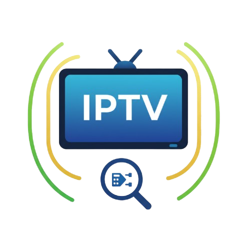

# IPTV Stream Sniffer

IPTV流嗅探工具，用于批量测试IPTV流地址的可用性，支持自动截图、频道管理和AI识别。



## 功能特性

### 核心功能
- 🔍 **批量测试**：自动遍历IP范围，批量测试IPTV流的可用性
- 📸 **自动截图**：对可用的流进行截图保存，支持分辨率检测
- 🤖 **AI识别**：使用AI模型自动识别频道名称和台标
- 📺 **频道管理**：完整的频道库管理，支持频道名称、Logo、TVG ID等信息
- 📑 **分组管理**：支持频道分组，拖拽排序
- 🔄 **连通性测试**：批量测试频道连通性，实时更新状态
- 📥 **M3U导入/导出**：支持标准M3U播放列表格式
- 🌐 **多语言支持**：中英文界面切换
- ⚙️ **自定义配置**：支持配置FFmpeg参数（包括硬件加速）
- 🐳 **Docker支持**：提供完整的Docker镜像

### 筛选功能
- 按分组筛选
- 按分辨率筛选（4K/1080p/720p）
- 按连通性筛选（在线/离线）
- 按IP或频道名搜索

## 快速开始

### 使用Docker运行

```bash
docker run -d \
  --name iptv-sniffer \
  --device /dev/dri:/dev/dri \
  -p 9832:9832 \
  -v $(pwd)/screenshots:/app/screenshots \
  -v $(pwd)/config:/app/config \
  ghcr.io/thsrite/iptv_sniff:latest
```

访问 `http://localhost:9832` 即可使用。

### 本地开发

1. 安装依赖：
```bash
pip install -r requirements.txt
```

2. 确保已安装FFmpeg：
```bash
# Ubuntu/Debian
apt-get install ffmpeg

# macOS
brew install ffmpeg
```

3. 运行应用：
```bash
python main.py
```

访问 `http://localhost:9832` 即可使用。

## 使用说明

### 1. 流测试

在"Stream Test"标签页中：
1. 输入基础URL，使用 `{ip}` 作为IP地址的占位符
   - 例如：`http://192.168.3.2:7788/rtp/{ip}:8000`
2. 输入起始IP和结束IP
   - 例如：`239.253.248.1` 到 `239.253.248.256`
3. 点击"Start Test"开始测试

测试结果会显示：
- 实时测试进度
- 自动截图
- 分辨率信息
- 筛选功能（全部/成功/失败，4K/1080p/720p）

### 2. 频道管理

在"TV Channels"标签页中可以：
- **导入M3U**：从现有M3U文件导入频道列表
- **AI识别**：使用AI模型自动识别频道名称
- **连通性测试**：批量测试所有频道的连通性
- **编辑频道信息**：
  - 频道名称
  - Logo（点击Logo可编辑URL）
  - TVG ID
  - 分组
- **筛选和搜索**：
  - 按分组筛选
  - 按分辨率筛选
  - 按连通性筛选
  - 按IP或频道名搜索
- **导出M3U**：导出完整的M3U播放列表

### 3. 分组管理

在"TV Groups"标签页中可以：
- 创建新分组
- 重命名/删除分组
- 拖拽调整分组顺序
- 向分组添加频道
- 从分组移除频道

### 4. 高级设置

在"Advanced Settings"标签页中可以配置：

**FFmpeg设置**
- 超时时间
- 并发队列大小
- 自定义FFmpeg参数（如硬件加速）

**AI模型配置**
- 启用/禁用AI识别
- AI API URL
- API密钥
- 模型名称（支持GPT-4 Vision、Claude 3等）

常用硬件加速配置：
- Intel Quick Sync (VAAPI): `-hwaccel vaapi -hwaccel_device /dev/dri/renderD128 -hwaccel_output_format vaapi`
- NVIDIA GPU: `-hwaccel cuda -hwaccel_output_format cuda`

## API接口

### 测试相关
```http
# 开始测试
POST /api/test/start
Content-Type: application/json

{
  "base_url": "http://192.168.3.2:7788/rtp/{ip}:8000",
  "start_ip": "239.253.248.1",
  "end_ip": "239.253.248.256"
}

# 获取测试状态
GET /api/test/status/{test_id}

# 重试测试
POST /api/test/retry
```

### 频道管理
```http
# 获取所有频道
GET /api/channels

# 更新频道信息
POST /api/channels/update
Content-Type: application/json

{
  "ip": "239.253.248.1",
  "name": "CCTV-1",
  "logo": "http://example.com/logo.png",
  "tvg_id": "CCTV1"
}

# 测试连通性
POST /api/channels/test-connectivity

# 导入M3U
POST /api/channels/import-m3u

# 导出M3U
GET /api/channels/export-m3u
```

### 分组管理
```http
# 获取所有分组
GET /api/groups

# 创建分组
POST /api/groups/create

# 更新分组
POST /api/groups/update

# 删除分组
POST /api/groups/delete
```

### 配置管理
```http
# 获取配置
GET /api/config

# 保存配置
POST /api/config
```

## 技术栈

- **后端**：Python + Flask
- **前端**：HTML + CSS + JavaScript
- **视频处理**：FFmpeg（支持硬件加速）
- **AI识别**：OpenAI/Anthropic等多模态模型
- **数据存储**：JSON文件
- **容器化**：Docker

## 项目结构

```
iptv_sniff/
├── main.py                 # Flask后端主程序
├── index.html              # 前端页面
├── static/
│   ├── style.css          # 样式文件
│   ├── script.js          # 前端逻辑
│   └── languages.js       # 多语言配置
├── screenshots/           # 截图存储目录
├── config/                # 配置文件目录
├── requirements.txt       # Python依赖
├── Dockerfile            # Docker镜像构建文件
└── docker-entrypoint.sh  # Docker入口脚本
```

## 数据文件

- `tv_channels.json`: 频道数据库
- `tv_groups.json`: 分组信息
- `results.json`: 测试结果
- `config/config.json`: 系统配置
- `screenshots/`: 截图文件

## 环境变量

- `PORT`: 服务端口（默认：9832）
- `PYTHONUNBUFFERED`: 禁用Python输出缓冲（默认：1）

## 注意事项

1. 如果需要使用硬件加速，确保Docker容器可以访问相应的硬件设备（如`/dev/dri`）
2. AI识别功能需要配置有效的API密钥
3. 并发测试数量有限制（默认最多5个并发），可在高级设置中调整
4. 筛选条件和标签页状态会自动保存到localStorage
5. M3U导出会按照频道列表当前的排序和筛选条件

## 常见问题

**Q: 如何使用AI识别频道？**
A: 在高级设置中配置AI API URL和密钥，然后在频道页面点击"AI识别频道"按钮。

**Q: 支持哪些AI模型？**
A: 支持所有兼容OpenAI Vision API格式的模型，包括GPT-4 Vision、Claude 3等。

**Q: 如何导入现有的M3U文件？**
A: 在频道页面点击"导入M3U"按钮，选择M3U文件即可自动导入所有频道信息。

**Q: 频道连通性测试失败怎么办？**
A: 检查网络连接和URL是否正确，可以在高级设置中增加超时时间。

## License

MIT License
